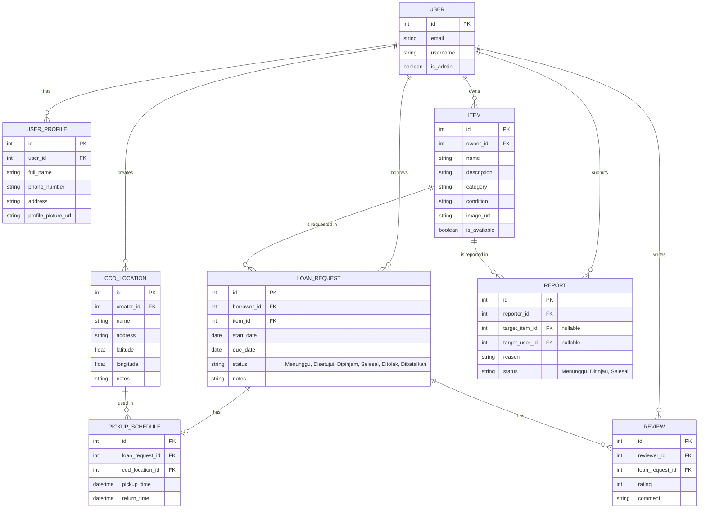
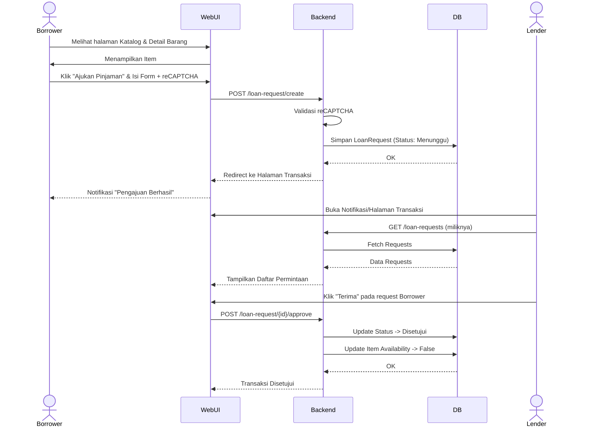

# System Design: ShareSpace ♻️

ShareSpace adalah platform *lending library* berbasis komunitas yang dibangun menggunakan arsitektur web modern. Dokumen ini merangkum rancangan sistem (System Design) berdasarkan kebutuhan yang tertulis dalam `README.md` dan struktur awal tampilan antarmuka (`html` & `css`).

---

## 1. Arsitektur Sistem & Tech Stack

Aplikasi ShareSpace dirancang menggunakan pola arsitektur **MTV (Model-Template-View)** yang umum pada **Django** (Python). 

```mermaid
flowchart TD
    Client[Client Browser]
    
    subgraph Django Application
        Views[Django Views]
        Templates[Django Templates\nHTML/CSS]
        Models[Django Models\nORM]
    end
    
    DB[(Database\ne.g., PostgreSQL/SQLite)]
    
    subgraph External APIs
        Auth[Google OAuth 2.0]
        Captcha[Google reCAPTCHA]
        Maps[OSM / Overpass API]
    end

    Client <-->|HTTP Request/Response| Views
    Views <--> Templates
    Views <--> Models
    Models <--> DB
    
    Views <-->|API Calls| External APIs
```

- **Frontend:** HTML5, CSS3, dan JavaScript (Leaflet.js untuk peta). Desain UI sudah mengadopsi pendekatan responsif dan aksesibilitas (terlihat dari `base.html` dan `style.css`).
  - **Interaktivitas Sisi Klien:** Diperkaya dengan **AJAX / HTMX** (sesuai spesifikasi proyek) untuk pengalaman pengguna yang dinamis tanpa *full page reload* (contoh: load data ulasan, filter katalog).
- **Backend:** Django (Python).
  - **Auth & Filter:** Implementasi kontrol akses dan filter spesifik pengguna (contoh: halaman profil, data pinjaman pribadi) berdasarkan *session* pengguna yang login.
- **Database:** Relational Database (seperti PostgreSQL untuk production di PWS).

---

## 2. Entity-Relationship Diagram (ERD)

Berdasarkan pembagian modul, berikut adalah rancangan model database utama untuk ShareSpace:



---

## 3. Integrasi Eksternal (Public APIs)

ShareSpace sangat bergantung pada integrasi API pihak ketiga untuk memperkaya fungsionalitas:

1. **Google Identity Services (OAuth 2.0):** 
   - Digunakan untuk Single Sign-On (SSO). 
   - Mengambil `email`, `nama`, dan `profile_picture` saat registrasi/login.
2. **Google reCAPTCHA:**
   - Diintegrasikan di halaman/form "Ajukan Peminjaman" (`LoanRequest`) untuk mencegah spam bot.
3. **OpenStreetMap & Overpass API:**
   - Digunakan pada penentuan `CODLocation`.
   - Mengambil POI (Point of Interest) publik seperti taman, kafe, atau perpustakaan di sekitar lokasi user untuk rekomendasi tempat COD.

---

## 4. Alur Interaksi Pengguna (User Flow)

Berikut adalah diagram sekuens untuk salah satu fitur utama aplikasi: **Alur Peminjaman Barang.**



---

## 5. Pemetaan UI & Template (Berdasarkan Kode Saat Ini)

Saat ini, Anda sudah memiliki:
- `base.html`: Kerangka utama (Header, Navigasi, Footer). Memuat `style.css`.
- `index.html`: Landing page (Hero section, Tentang, Cara Kerja, Manfaat).
- `style.css`: Styling global dengan palet warna "Sustainable" (hijau, cream, lime).

**Rencana Halaman Selanjutnya (Sesuai Modul):**

1. **Autentikasi (`/auth/...`)**
   - Halaman Login/Register terintegrasi dengan tombol "Sign in with Google".
   - Halaman Profil Pengguna (Edit kontak, domisili, lihat Trust Score).
2. **Katalog (`/katalog/...`)**
   - Halaman Daftar Barang (Grid cards) dengan Filter (Kategori, Kondisi) & Search bar.
   - Halaman Detail Barang.
   - Halaman Form Tambah Barang.
3. **Transaksi (`/transaksi/...`)**
   - Dashboard Transaksi (Daftar Pinjaman Aktif, Riwayat, Permintaan Masuk).
   - Halaman Form Peminjaman (dengan Google reCAPTCHA).
4. **Lokasi COD (`/cod/...`)**
   - Halaman Peta Interaktif (Leaflet.js) untuk memilih atau melihat lokasi COD.
5. **Review & Laporan (`/review/...`, `/report/...`)**
   - Halaman Form Ulasan (dengan bintang 1-5).
   - Dashboard Admin untuk mengelola ulasan dan menindaklanjuti Laporan pengguna.

